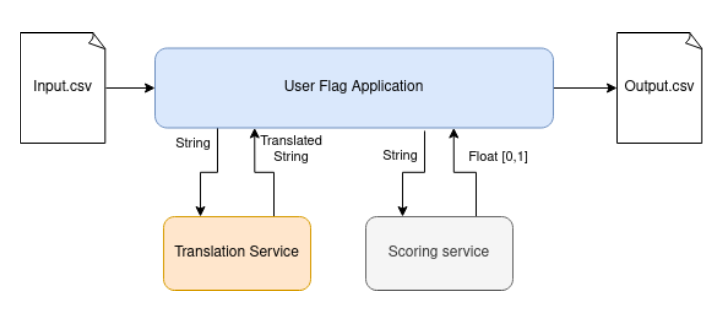

# User Flag Project

## Overview
A social network startup has hired you to participate in building its content moderation system.
This system will identify users who post offensive or abusive messages in the comments section
by assigning a score to each message and generating a report with the offensive score per
user.
The User Flag project is a Spring Boot application designed for processing CSV data. 
It features a REST API endpoint that accepts CSV formatted text as input and returns processed results.



## Features
- REST API endpoint to process CSV data.
- Built with Spring Boot, making it efficient and scalable for web applications.

## Requirements
- Java 17 or higher
- Maven 3.x or higher

## Installation
- Clone the code from repository
- Run maven install command: `mvn install`
- To serve the api run the command: `mvn spring-boot:run`
- It will serve the api under localhost:8000
- To run the tests use the command: `mvn test`
- All command should be run from the root directory

### Building the Project
To build the project, navigate to the project's root directory and run:
```bash
mvn clean install
